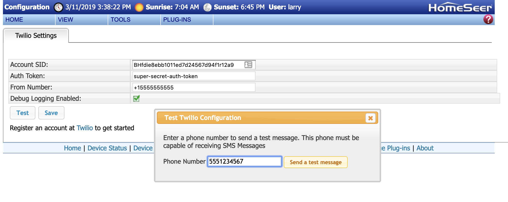
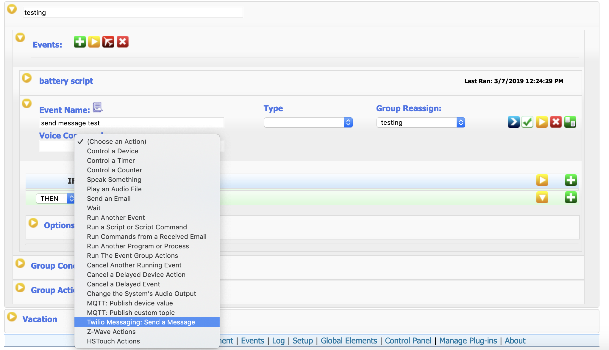
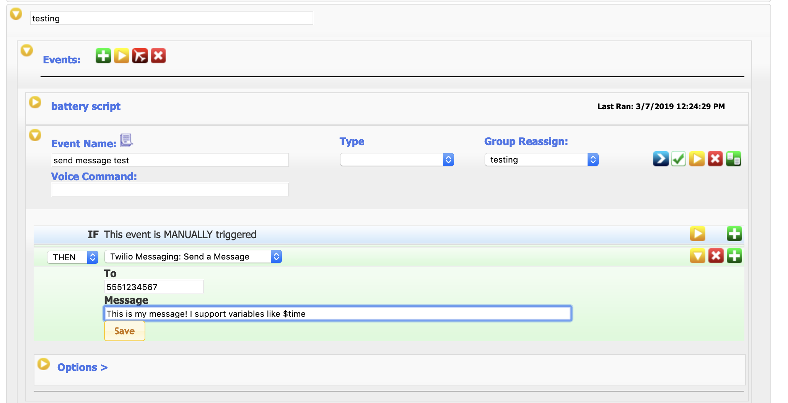

This plugin integrates the [Twilio](https://twilio.com) messaging platform with HomeSeer.
You can create HomeSeer events which send SMS messages to alert on whatever you desire.

## Prerequisites
1) A Twilio account with Programmable SMS configured
2) HomeSeer 3 installation

## Installation
(coming soon)

## Setup
1) Go to Plugins -> Twilio Messaging -> Configuration in HomeSeer
2) Enter your Account SID, Auth Token, and "From" phone number from your Twilio Programmable SMS settings
3) Perform a test to ensure settings are working correctly.

## Usage
This plugin can be used to notify you of events taking place.

1) From a HomeSeer event, locate and select the "Twilio Messaging: Send a Message" option:

2) Enter the message recipient, and the message you wish to send

3) Done!

## Support

File an issue in the [Twilio Messaging GitHib Repository](https://github.com/legrego/HSPI_TwilioMessaging)