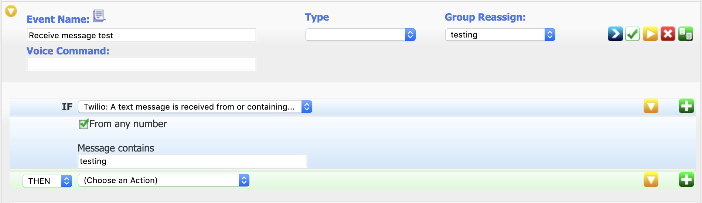

This plugin integrates the [Twilio](https://twilio.com) messaging platform with HomeSeer.
You can create HomeSeer events which send SMS messages to alert on whatever you desire.

## Prerequisites
1) A Twilio account with Programmable SMS configured
2) HomeSeer 3 installation

## Installation
(coming soon)

## Setup
1) Go to Plugins -> Twilio Messaging -> Configuration in HomeSeer
2) Enter your Account SID, Auth Token, and "From" phone number from your Twilio Programmable SMS settings
3) Perform a test to ensure settings are working correctly.

## Usage

### Notify when events take place
This plugin can be used to notify you of events taking place.

1) From a HomeSeer event, locate and select the "Twilio Messaging: Send a Message" option:

2) Enter the message recipient, and the message you wish to send

3) Done!

### Trigger an event when a message is received
In addition to responding to events, you can use this plugin to trigger events when you send messages to your configured Twilio number.

1) Create a new HomeSeer event. Locate and select the "Twilio: A text message is received from or containing..." option.

2) Optionally filter the trigger by sender ("From number"). By default, this trigger will fire for any sender.

3) Specify the message text to look for. This is a case-insensitive test. If a message is received containing this text, then the trigger will fire.

## Support

File an issue in the [Twilio Messaging GitHib Repository](https://github.com/legrego/HSPI_TwilioMessaging)

## Changelog

### 0.1.0
_2019-03-03_
- Initial Release

### 0.2.0
_2019-03-22_
- Adds support for triggering events when messages are received

